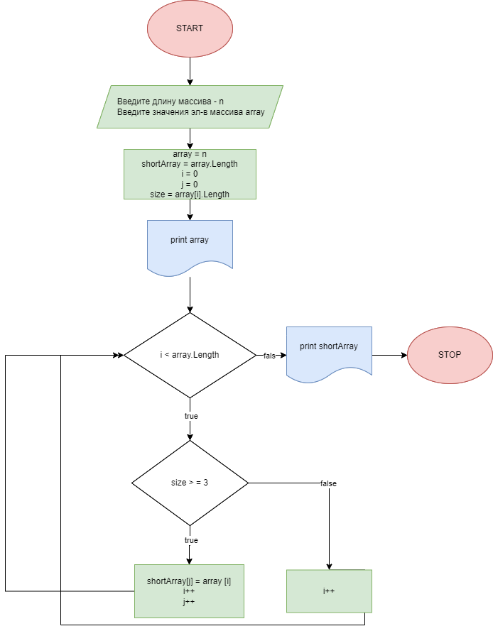

# Была поставлена задача:

 _Написать программу, которая из имеющегося массива строк формирует новый массив из строк, длина которых меньше, либо равна 3 символам. Первоначальный массив можно ввести с клавиатуры, либо задать на старте выполнения алгоритма. При решении не рекомендуется пользоваться коллекциями, лучше обойтись исключительно массивами._

Прежде чем приступить к написанию кода для решения задачи, составим блок-схему алгоритма, чтобы понять, как вообще справиться с этой задачей: 

# _Итак, приступим к написанию кода:_
1. Просим пользователя задать через терминал длину массива, присвоив это значение переменной n. Здесь же, при помощи оператора ReadLine просим пользователя ввести элементы, которыми будет заполнен наш исходный массив, состоящий из строк. И сразу же объявляем о создании массива array. Так как этот массив будет состоять из строк, то пользователь сможет ввести абсолютно любые символы.

2. Сразу выведем полученный массив на экран терминала, чтобы ползователь увидел исходный массив, с которым будет работать программа. Для этого, напишем метод PrintArray, котрый принимает на воход массив array, который ввел пользователь. При помощи склеивания строк String.Join выводим на экран массив в нужном нам формате.

3. Далее, при помощи метода PrintShortArray выведем на экран терминала новый массив shortArray, в который будут записаны только те элементы исходного массива, которые удовлетворяют условию: длина строки (элемента массива) меньше или равна 3 символам. Создадим новый массив в теле метода, длину массива возьмем равной длине исходного массива, на случай, если все элементы будут удовлетворять нашему условию и их нужно будет перенестивы результирующий массив.

4. Для заполнения результрующего массива shortArray напишем метод при помощи цикла for проходимся по всему массиву array и при каждой итерации сначала определяет длину каждого элемента массива array, затем, если длина меньше или равна 3 записывает значение текущего элемента массива array в массив shortArray. Если данное условие не выполняется, то в текущий элемент shortArray ничего не записываем и идем к следующему элементу. После того, как прошлись по всем элементам, цикл завершает свою работу и заполненный массив shortArray.

5. Однако, наш новый массив может содержать пустые элементы, т.н. String.Empty, в том случае, если были элементы не удовлетворяющие условию их переноса. Чтобы избавиться от них, используем функцию Array.Resize, которая удалит нужное нам количество пустых элементов.

6. Метод PrintShortArray завершает свою работу выводом в терминала результирующего массива.